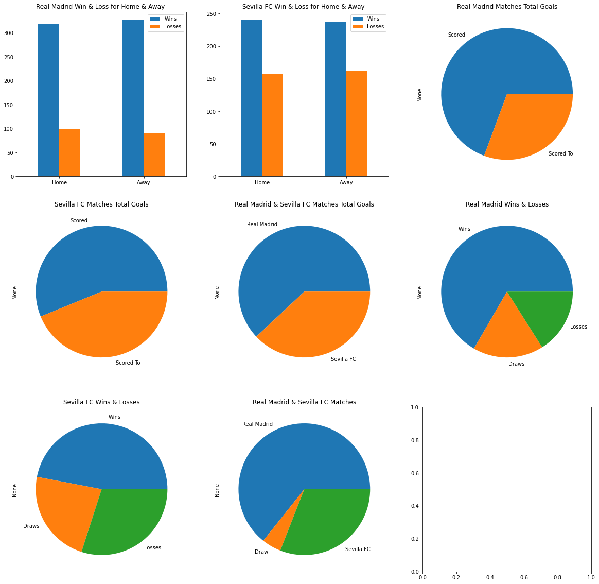
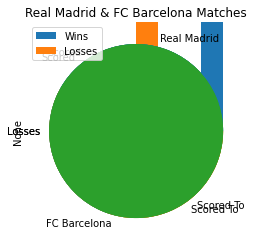

# Winners


```python
#import all libraries we used
import pandas as pd
from bs4 import BeautifulSoup
import requests
import html5lib
import os
import re
import sklearn
import matplotlib as mpl
import matplotlib.pyplot as plt
%matplotlib inline
from sklearn.model_selection import train_test_split
from sklearn.linear_model import LogisticRegression,LinearRegression
from sklearn.metrics import f1_score
```

## Crawling


```python
#create our DataFrame

def createDf():
    data = {'Round': [], 'Season': [], 'Date':[], 'Hour':[], 'HomeTeam': [], 'GuestTeam': []
            , 'Score': [],'ScoreDiff':[],'Winners': []}
    df = pd.DataFrame(data)
    return df
```


```python
#Create a string of two seasons

def season(firstY,secondY):
    years = firstY+"-"+secondY
    return years
```


```python
#Create BeautifulSoup object

def load_soup_object(years,rounds):
    try:
        if years == "2016-2017":
            url = "https://www.worldfootball.net/schedule/esp-primera-division-"+years+"-spieltag_2/"+rounds
        else:
            url = "https://www.worldfootball.net/schedule/esp-primera-division-"+years+"-spieltag/"+rounds
        r = requests.get(url)
        soup = BeautifulSoup(r.text,'html.parser')
    except:
        print("there was problem in years "+ years + "and round "+rounds+".")
    return soup
```


```python
#Insert our BeautifulSoup object to our Dataframe

def insertSoupToDataFrame(soup,df,rounds,years):
    
    date=list()
    hour=list()
    homeTeam=list()
    guestTeam=list()
    score=list()
    
    table = soup.find('table',attrs={"class":"standard_tabelle"})
    
    for row in table("tr"):
        cells = row("td")
        if(len(cells)<6):
            continue
        if cells[0].get_text() != "":
            temp = cells[0].get_text()
            date.append(cells[0].get_text())
        else:
            date.append(temp)
        hour.append(cells[1].get_text())
        homeTeam.append(cells[2].get_text().strip())
        guestTeam.append(cells[4].get_text().strip())
        score.append(cells[5].get_text().strip())
               
    data = {'Round': rounds, 'Season': years, 'Date':date, 'Hour':hour, 'HomeTeam': homeTeam, 'GuestTeam': guestTeam,
            'Score': score}
    df = pd.DataFrame(data)
    return df
    
```


```python
#Our main function to get our data using the last functions of creatring BeautifulSoup and dataframe

def getData():
    yearList = ["2000", "2001", "2002","2003", "2004", "2005","2006", "2007", "2008","2009",
                "2010", "2011","2012", "2013", "2014","2015", "2016", "2017","2018", "2019", "2020","2021", "2022"]

    roundsList = ["1", "2", "3", "4", "5", "6", "7", "8", "9", "10",
                  "11", "12","13", "14", "15", "16", "17", "18", "19", "20",
                  "21", "22", "23", "24", "25", "26", "27", "28", "29", "30",
                  "31", "32", "33", "34", "35", "36", "37", "38"]

    df = createDf()
    tempYear = 0;
    tempRounds = 0;
    for year in yearList:
        if yearList[tempYear] == "2022" :
            break
        years = season(yearList[tempYear],yearList[tempYear+1])
        for rounds in roundsList:
            soup = load_soup_object(years,rounds)
            df1 = insertSoupToDataFrame(soup,df,rounds,years)
            df = df.append(df1, ignore_index=True)
            tempRounds = tempRounds+1
        tempYear=tempYear+1
    
    return df
```

## Cleaning the Data


```python
#Check the score and fill winners column 

def getWinners(df):
    df1 = df.copy()
    temp = df.Score
    winners = list()
    for i in temp:
        if i[0] < i[2]:
            winners.append("Away")
        elif i[0] > i[2]:
            winners.append("Home")
        else:
            winners.append("Draw")
    df1.Winners = winners
    return df1
```


```python
#Edit the score 

def editScore(df):
    df1 = df.copy()
    scoreList = df.Score
    tempDiff = 0
    diff = list()
    scoreEdit = list()
    for i in scoreList:
            i = i[0: 3]
            scoreEdit.append(i)
            try:
                temp = int(i[0]) - int(i[2])
            except:
                temp = "NaN"
            diff.append(temp)
    df1.Score = scoreEdit
    df1.ScoreDiff = diff
    return df1
```


```python
def teamsToNumeric(df,first,second):
    df1 = df.copy()
    df1.loc[(df['HomeTeam'] == first),'HomeTeam']= 1
    df1.loc[(df['GuestTeam'] == second),'GuestTeam']= 2
    return df1
```


```python
def winnersToNumeric(df):
    df1 = df.copy()
    df1.loc[(df.Winners == 'Home'),'Winners']= 1
    df1.loc[(df.Winners == 'Draw'),'Winners']= 0
    df1.loc[(df.Winners == 'Away'),'Winners']= 2

    return df1
```


```python
def cleanData(df,firstTeam,secondTeam):
    df1 = df.copy()
    df2 = getWinners(df1)
    df3 = editScore(df2)
    df4 = df3.drop(['Season', 'Date','Hour'], axis=1)
    df5 = df4.dropna(axis=0)
    df6 = TwoTeamsDataFarmeFilterByOrder(df5,firstTeam,secondTeam)
    df7 = teamsToNumeric(df6,firstTeam,secondTeam)
    df8 = winnersToNumeric(df7)
    df9 = df8.drop(['Score'], axis=1)
    df10 = df9.astype('int')
    df11 = df10.copy()
    return df11
```

## EDA


```python

# Filter DataFrame to have only games participated by a certine team (home & away)

def OneTeamDataFrameFilter(df, team):
    df1 = df.copy()
    return df1.loc[(df1['HomeTeam'] == team) | (df1['GuestTeam'] == team)]
```


```python

#Filter DataFrame to have only games participated by certine 2 teams (home & away)

def TwoTeamsDataFarmeFilter(df, team1, team2):
    df1 = df.copy()
    return pd.concat([df1.loc[(df1['HomeTeam'] == team1) & (df1['GuestTeam'] == team2)],df1.loc[(df1['HomeTeam'] == team2) & (df1['GuestTeam'] == team1)]])
```


```python

#Filter DataFrame to have only games participated by certine 2 teams (home & away) but this time by order

def TwoTeamsDataFarmeFilterByOrder(df, team1, team2):
    df1 = df.copy()
    return pd.concat([df1.loc[(df1['HomeTeam'] == team1) & (df1['GuestTeam'] == team2)]])
```


```python

# charts maker

def one_dim_plot(sr, plot_type,plot_title):
    return sr.plot(kind=plot_type, title=plot_title)
```


```python

# two teams win & loss ratio - pie chart

def TwoTeamsWinsPieChart(df, team1, team2):
    df_copy = TwoTeamsDataFarmeFilter(df, team1, team2)
    
    team1_wins = len(df_copy[(df_copy['HomeTeam'] == team1) & (df_copy['Winners']=='Home')].index) + len(df_copy[(df_copy['GuestTeam'] == team1) & (df_copy['Winners']=='Away')].index)
    draws= 0
    for winner in df_copy.Winners:
        if winner == 'Draw':
            draws = draws+1
    team2_wins= len(df_copy[(df_copy['HomeTeam'] == team2) & (df_copy['Winners']=='Home')].index) + len(df_copy[(df_copy['GuestTeam'] == team2) & (df_copy['Winners']=='Away')].index)
    
    sr_data = pd.Series([team1_wins,draws,team2_wins], index=[team1, 'Draw', team2])
    one_dim_plot(sr_data, 'pie', f"{team1} & {team2} Matches")
```


```python

# one team win & loss all time ratio - pie chart

def OneTeamWinsPieChart(df, team):
    df_copy =OneTeamDataFrameFilter(df, team)
    wins=len(df_copy[(df_copy['HomeTeam'] == team) & (df_copy['Winners']=='Home')].index) + len(df_copy[(df_copy['GuestTeam'] == team) & (df_copy['Winners']=='Away')].index)
    draws=0
    for winner in df_copy.Winners:
        if winner == 'Draw':
            draws = draws+1
    losses= len(df_copy.index)-wins-draws
    
    sr_data = pd.Series([wins,draws,losses], index=['Wins', 'Draws', 'Losses'])
    one_dim_plot(sr_data, 'pie', f"{team} Wins & Losses")
```


```python
# two teams goals all time ratio - pie chart

def TwoTeamsGoalsPieChart(df, team1, team2):
    df_copy = TwoTeamsDataFarmeFilter(df, team1, team2)
    team1_score = 0
    team2_score = 0
    for index in df_copy.index:
        
        home_score = int(df_copy['Score'][index][0]) 
        away_score = int(df_copy['Score'][index][2] )
        
        if(df_copy['HomeTeam'][index] == team1):
            team1_score += home_score
            team2_score += away_score
        else:
            team1_score += away_score
            team2_score += home_score
            
    sr_data = pd.Series([team1_score,team2_score], index=[team1, team2])
    one_dim_plot(sr_data, 'pie', f"{team1} & {team2} Matches Total Goals")
```


```python

# one team goals all time ratio - pie chart

def OneTeamGoalsPieChart(df, team):
    df_copy = OneTeamDataFrameFilter(df, team)
    scored = 0
    scored_to = 0
    for index in df_copy.index:
        try:
            home_score = int(df_copy['Score'][index][0]) 
            away_score = int(df_copy['Score'][index][2] )
        
            if(df_copy['HomeTeam'][index] == team):
                scored += home_score
                scored_to += away_score
            else:
                scored += away_score
                scored_to += home_score
        except:
            continue
    sr_data = pd.Series([scored,scored_to], index=['Scored', 'Scored To'])
    one_dim_plot(sr_data, 'pie', f"{team} Matches Total Goals")
```


```python

#

def HomeAwayWinLossRatiosBarChart(df, team):
    df_copy = OneTeamDataFrameFilter(df,team)
    
    home_resault_df = pd.DataFrame({'Wins':[0,0], 'Losses':[0,0]}, index = ['Home','Away'])
    away_resault_df = pd.DataFrame({'Wins':[0], 'Losses':[0]}, index = ['Away'])
    
    for index in df_copy.index:
        if(df_copy['HomeTeam'][index] == team):
            if(df_copy['Winners'][index] == 'Home'):
                home_resault_df['Wins'][0]+=1
            else:
                home_resault_df['Losses'][0]+=1
        else:
            if(df_copy['Winners'][index] == 'Home'):
                home_resault_df['Losses'][1]+=1
            else:
                home_resault_df['Wins'][1]+=1
                
    ax = home_resault_df.plot.bar(rot=0)  
    print(home_resault_df)
        
    
    
```


```python
def printEDA(df,firstTeam,secondTeam):
    HomeAwayWinLossRatiosBarChart(df, firstTeam)
    HomeAwayWinLossRatiosBarChart(df, secondTeam)
    OneTeamGoalsPieChart(df, firstTeam)
    OneTeamGoalsPieChart(df, secondTeam)
    TwoTeamsGoalsPieChart(df,firstTeam, secondTeam)
    OneTeamWinsPieChart(df, firstTeam)
    OneTeamWinsPieChart(df, secondTeam)
    TwoTeamsWinsPieChart(df, firstTeam, secondTeam)
```


```python
HomeAwayWinLossRatiosBarChart(df2, 'Málaga CF')
```


```python
HomeAwayWinLossRatiosBarChart(df2, 'Atlético Madrid')
```


```python
OneTeamGoalsPieChart(df2,'Atlético Madrid')
```


```python
TwoTeamsGoalsPieChart(df2,'Atlético Madrid', 'Real Madrid')
```


```python
OneTeamWinsPieChart(df2, 'FC Barcelona')
```


```python
TwoTeamsWinsPieChart(df2, 'Atlético Madrid', 'Real Madrid')
```


```python
TwoTeamsWinsPieChart(df2, 'Real Zaragoza', 'FC Barcelona')
```

## Machine Learning


```python
def load_dataset(df, target_column):
    X = df
    y = X.pop(target_column)
    return X, y
```

### LinearRegression


```python
def train_1st_model(X_train, y_train):
    trained_model=LinearRegression()
    trained_model.fit(X_train,y_train)
    
    return trained_model
```


```python
def predict_1st(trained_1st_model, X_test):
    predict=trained_1st_model.predict(X_test)
    return predict
```


```python
def linearRegerssion(df):
    train, test = train_test_split(df, test_size=0.2)
    
    X_1st_train, y_1st_train = load_dataset(train, "Winners")
    X_1st_test, y_1st_test = load_dataset(test, "Winners")
    trained_model_1st = train_1st_model(X_1st_train, y_1st_train)
    pred_1st_vals = predict_1st(trained_model_1st, X_1st_test)
 
    return pred_1st
```

### LogisticRegression


```python
def train_2nd_model(X_train, y_train):
    trained_model = LogisticRegression()
    trained_model.fit(X_train, y_train)
    
    return trained_model
```


```python
def predict_2nd(trained_2nd_model, X_test):
    predicted_vals=trained_2nd_model.predict(X_test)
    return predicted_vals
```


```python
def evaluate_performance_2nd(y_test,y_predicted):
    evaluate_value= f1_score(y_test,y_predicted,average='micro')
    return evaluate_value
```


```python
def logisticRegerssion(df):
    train, test = train_test_split(df, test_size=0.2)
    X_2nd_train, y_2nd_train = load_dataset(train, "Winners")
    X_2nd_test, y_2nd_test = load_dataset(test, "Winners")
    trained_model_2nd = train_2nd_model(X_2nd_train, y_2nd_train)
    pred_2nd_vals = predict_2nd(trained_model_2nd, X_2nd_test)
    y_pred_2nd = pd.Series(pred_2nd_vals,index=X_2nd_test.index)
    resDF=pd.DataFrame({"Actual":y_2nd_test,"Predicted":y_pred_2nd})
    eval_res_2nd = evaluate_performance_2nd(y_2nd_test, y_pred_2nd)
    evelSeries.append(eval_res_2nd)
    return y_pred_2nd,resDF,evelSeries
```


```python
evelSeries=list()
```

## Main

### Get new data and save to csv


```python
df1 = getData()
df1.to_csv('data.csv')
```

### Using existing data from csv 


```python
df = pd.read_csv('data.csv')
df1 = df.drop(['Unnamed: 0'], axis=1)
df1
```


<div>
<style scoped>
    .dataframe tbody tr th:only-of-type {
        vertical-align: middle;
    }

    .dataframe tbody tr th {
        vertical-align: top;
    }

    .dataframe thead th {
        text-align: right;
    }
</style>
<table border="1" class="dataframe">
  <thead>
    <tr style="text-align: right;">
      <th></th>
      <th>Round</th>
      <th>Season</th>
      <th>Date</th>
      <th>Hour</th>
      <th>HomeTeam</th>
      <th>GuestTeam</th>
      <th>Score</th>
      <th>ScoreDiff</th>
      <th>Winners</th>
    </tr>
  </thead>
  <tbody>
    <tr>
      <th>0</th>
      <td>1</td>
      <td>2000-2001</td>
      <td>09/09/2000</td>
      <td>NaN</td>
      <td>Real Zaragoza</td>
      <td>Espanyol Barcelona</td>
      <td>1:2 (0:0)</td>
      <td>NaN</td>
      <td>NaN</td>
    </tr>
    <tr>
      <th>1</th>
      <td>1</td>
      <td>2000-2001</td>
      <td>09/09/2000</td>
      <td>NaN</td>
      <td>Real Madrid</td>
      <td>Valencia CF</td>
      <td>2:1 (0:0)</td>
      <td>NaN</td>
      <td>NaN</td>
    </tr>
    <tr>
      <th>2</th>
      <td>1</td>
      <td>2000-2001</td>
      <td>09/09/2000</td>
      <td>NaN</td>
      <td>FC Barcelona</td>
      <td>Málaga CF</td>
      <td>2:1 (2:0)</td>
      <td>NaN</td>
      <td>NaN</td>
    </tr>
    <tr>
      <th>3</th>
      <td>1</td>
      <td>2000-2001</td>
      <td>09/09/2000</td>
      <td>NaN</td>
      <td>Deportivo La Coruña</td>
      <td>Athletic Bilbao</td>
      <td>2:0 (0:0)</td>
      <td>NaN</td>
      <td>NaN</td>
    </tr>
    <tr>
      <th>4</th>
      <td>1</td>
      <td>2000-2001</td>
      <td>09/09/2000</td>
      <td>NaN</td>
      <td>Real Sociedad</td>
      <td>Racing Santander</td>
      <td>2:2 (0:0)</td>
      <td>NaN</td>
      <td>NaN</td>
    </tr>
    <tr>
      <th>...</th>
      <td>...</td>
      <td>...</td>
      <td>...</td>
      <td>...</td>
      <td>...</td>
      <td>...</td>
      <td>...</td>
      <td>...</td>
      <td>...</td>
    </tr>
    <tr>
      <th>8355</th>
      <td>38</td>
      <td>2021-2022</td>
      <td>22/05/2022</td>
      <td>19:00</td>
      <td>CD Alavés</td>
      <td>Cádiz CF</td>
      <td>0:1 (0:0)</td>
      <td>NaN</td>
      <td>NaN</td>
    </tr>
    <tr>
      <th>8356</th>
      <td>38</td>
      <td>2021-2022</td>
      <td>22/05/2022</td>
      <td>19:00</td>
      <td>Granada CF</td>
      <td>Espanyol Barcelona</td>
      <td>0:0 (0:0)</td>
      <td>NaN</td>
      <td>NaN</td>
    </tr>
    <tr>
      <th>8357</th>
      <td>38</td>
      <td>2021-2022</td>
      <td>22/05/2022</td>
      <td>21:00</td>
      <td>FC Barcelona</td>
      <td>Villarreal CF</td>
      <td>0:2 (0:1)</td>
      <td>NaN</td>
      <td>NaN</td>
    </tr>
    <tr>
      <th>8358</th>
      <td>38</td>
      <td>2021-2022</td>
      <td>22/05/2022</td>
      <td>21:00</td>
      <td>Sevilla FC</td>
      <td>Athletic Bilbao</td>
      <td>1:0 (0:0)</td>
      <td>NaN</td>
      <td>NaN</td>
    </tr>
    <tr>
      <th>8359</th>
      <td>38</td>
      <td>2021-2022</td>
      <td>22/05/2022</td>
      <td>21:00</td>
      <td>Real Sociedad</td>
      <td>Atlético Madrid</td>
      <td>1:2 (0:0)</td>
      <td>NaN</td>
      <td>NaN</td>
    </tr>
  </tbody>
</table>
<p>8360 rows × 9 columns</p>
</div>


```python
df = df1.copy()
df
```


<div>
<style scoped>
    .dataframe tbody tr th:only-of-type {
        vertical-align: middle;
    }

    .dataframe tbody tr th {
        vertical-align: top;
    }

    .dataframe thead th {
        text-align: right;
    }
</style>
<table border="1" class="dataframe">
  <thead>
    <tr style="text-align: right;">
      <th></th>
      <th>Round</th>
      <th>Season</th>
      <th>Date</th>
      <th>Hour</th>
      <th>HomeTeam</th>
      <th>GuestTeam</th>
      <th>Score</th>
      <th>ScoreDiff</th>
      <th>Winners</th>
    </tr>
  </thead>
  <tbody>
    <tr>
      <th>0</th>
      <td>1</td>
      <td>2000-2001</td>
      <td>09/09/2000</td>
      <td>NaN</td>
      <td>Real Zaragoza</td>
      <td>Espanyol Barcelona</td>
      <td>1:2 (0:0)</td>
      <td>NaN</td>
      <td>NaN</td>
    </tr>
    <tr>
      <th>1</th>
      <td>1</td>
      <td>2000-2001</td>
      <td>09/09/2000</td>
      <td>NaN</td>
      <td>Real Madrid</td>
      <td>Valencia CF</td>
      <td>2:1 (0:0)</td>
      <td>NaN</td>
      <td>NaN</td>
    </tr>
    <tr>
      <th>2</th>
      <td>1</td>
      <td>2000-2001</td>
      <td>09/09/2000</td>
      <td>NaN</td>
      <td>FC Barcelona</td>
      <td>Málaga CF</td>
      <td>2:1 (2:0)</td>
      <td>NaN</td>
      <td>NaN</td>
    </tr>
    <tr>
      <th>3</th>
      <td>1</td>
      <td>2000-2001</td>
      <td>09/09/2000</td>
      <td>NaN</td>
      <td>Deportivo La Coruña</td>
      <td>Athletic Bilbao</td>
      <td>2:0 (0:0)</td>
      <td>NaN</td>
      <td>NaN</td>
    </tr>
    <tr>
      <th>4</th>
      <td>1</td>
      <td>2000-2001</td>
      <td>09/09/2000</td>
      <td>NaN</td>
      <td>Real Sociedad</td>
      <td>Racing Santander</td>
      <td>2:2 (0:0)</td>
      <td>NaN</td>
      <td>NaN</td>
    </tr>
    <tr>
      <th>...</th>
      <td>...</td>
      <td>...</td>
      <td>...</td>
      <td>...</td>
      <td>...</td>
      <td>...</td>
      <td>...</td>
      <td>...</td>
      <td>...</td>
    </tr>
    <tr>
      <th>8355</th>
      <td>38</td>
      <td>2021-2022</td>
      <td>22/05/2022</td>
      <td>19:00</td>
      <td>CD Alavés</td>
      <td>Cádiz CF</td>
      <td>0:1 (0:0)</td>
      <td>NaN</td>
      <td>NaN</td>
    </tr>
    <tr>
      <th>8356</th>
      <td>38</td>
      <td>2021-2022</td>
      <td>22/05/2022</td>
      <td>19:00</td>
      <td>Granada CF</td>
      <td>Espanyol Barcelona</td>
      <td>0:0 (0:0)</td>
      <td>NaN</td>
      <td>NaN</td>
    </tr>
    <tr>
      <th>8357</th>
      <td>38</td>
      <td>2021-2022</td>
      <td>22/05/2022</td>
      <td>21:00</td>
      <td>FC Barcelona</td>
      <td>Villarreal CF</td>
      <td>0:2 (0:1)</td>
      <td>NaN</td>
      <td>NaN</td>
    </tr>
    <tr>
      <th>8358</th>
      <td>38</td>
      <td>2021-2022</td>
      <td>22/05/2022</td>
      <td>21:00</td>
      <td>Sevilla FC</td>
      <td>Athletic Bilbao</td>
      <td>1:0 (0:0)</td>
      <td>NaN</td>
      <td>NaN</td>
    </tr>
    <tr>
      <th>8359</th>
      <td>38</td>
      <td>2021-2022</td>
      <td>22/05/2022</td>
      <td>21:00</td>
      <td>Real Sociedad</td>
      <td>Atlético Madrid</td>
      <td>1:2 (0:0)</td>
      <td>NaN</td>
      <td>NaN</td>
    </tr>
  </tbody>
</table>
<p>8360 rows × 9 columns</p>
</div>


```python
printEDA(df,'Real Madrid','FC Barcelona')
df1 = cleanData(df,'Real Madrid','FC Barcelona')
y_pred,resDF,evelList = logisticRegerssion(df1)
```

          Wins  Losses
    Home     0     418
    Away   418       0
          Wins  Losses
    Home     0     418
    Away   418       0
    

    C:\Users\danie\anaconda3\lib\site-packages\pandas\plotting\_matplotlib\core.py:1616: MatplotlibDeprecationWarning: normalize=None does not normalize if the sum is less than 1 but this behavior is deprecated since 3.3 until two minor releases later. After the deprecation period the default value will be normalize=True. To prevent normalization pass normalize=False 
      results = ax.pie(y, labels=blabels, **kwds)
    C:\Users\danie\anaconda3\lib\site-packages\sklearn\linear_model\_logistic.py:763: ConvergenceWarning: lbfgs failed to converge (status=1):
    STOP: TOTAL NO. of ITERATIONS REACHED LIMIT.
    
    Increase the number of iterations (max_iter) or scale the data as shown in:
        https://scikit-learn.org/stable/modules/preprocessing.html
    Please also refer to the documentation for alternative solver options:
        https://scikit-learn.org/stable/modules/linear_model.html#logistic-regression
      n_iter_i = _check_optimize_result(
    


    

    


    

    


```python
print(evelList)
resDF
```

    [1.0, 0.8000000000000002]
    


<div>
<style scoped>
    .dataframe tbody tr th:only-of-type {
        vertical-align: middle;
    }

    .dataframe tbody tr th {
        vertical-align: top;
    }

    .dataframe thead th {
        text-align: right;
    }
</style>
<table border="1" class="dataframe">
  <thead>
    <tr style="text-align: right;">
      <th></th>
      <th>Actual</th>
      <th>Predicted</th>
    </tr>
  </thead>
  <tbody>
    <tr>
      <th>5228</th>
      <td>2</td>
      <td>2</td>
    </tr>
    <tr>
      <th>5402</th>
      <td>1</td>
      <td>1</td>
    </tr>
    <tr>
      <th>240</th>
      <td>0</td>
      <td>1</td>
    </tr>
    <tr>
      <th>2012</th>
      <td>2</td>
      <td>2</td>
    </tr>
    <tr>
      <th>7894</th>
      <td>1</td>
      <td>1</td>
    </tr>
  </tbody>
</table>
</div>


